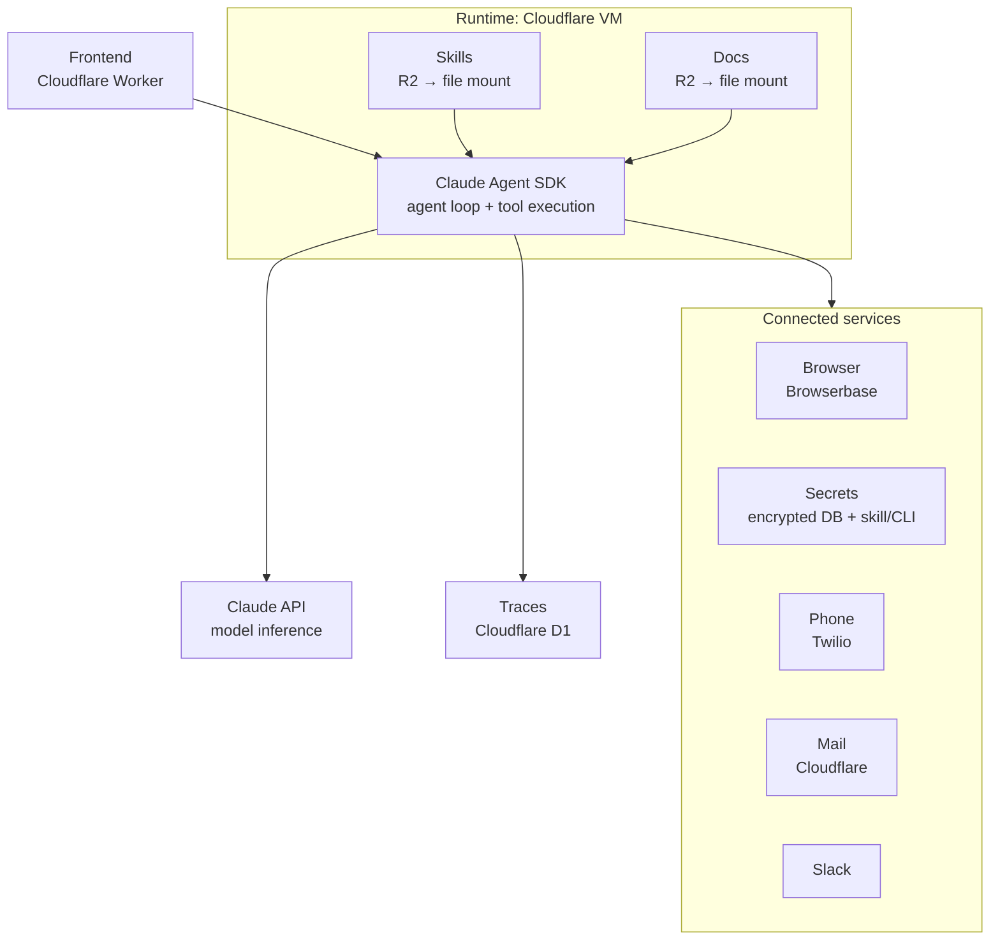

Prosus gave a Claude Agent SDK agent six real vending machines in Amsterdam and let it run them for four months. It lost money. Tests hit the live API, it bought stock that didn't fit, and it cut prices all summer. The talk is the best failure catalog I've seen for agents that act in the physical world instead of a repo.

Talk: [Everything wrong with AI agents running your business](https://www.youtube.com/watch?v=LJ2MTGvVHm8), Floris Fok (staff AI engineer at Prosus), AGNTCon + MCPCon, published 2026-09-25. 27 minutes.

## Why a vending machine

Prosus owns marketplaces, and most of the sellers on them are small businesses. The real question is whether an agent can run a restaurant. Floris argued for starting with the simplest real business first, and said he could build it in a day.

It took a lot longer than a day. He also went straight to six machines (snacks and drinks) instead of one.

## Turning a human dashboard into tools

The machines they could get quickly in the Netherlands came with a remote operator dashboard and a phone-based point of sale (POS). Both were built for humans.

- Dashboard: they grabbed the session token and reverse-engineered the dashboard's API calls into tool calls. Less than a day of work.
- POS: the vendor's POS only let you pick from a preset list of names and images. They rebuilt it from scratch for full control, which added two days.

They tested the tools by attaching them to a plain Claude SDK chatbot and driving the machines by prompt for a few minutes. In the end the whole operation (open the door, dispense, change an item, name or price) fit in two skills, each with a custom CLI inside.

## The architecture

This is the slide I screenshotted. It's a clean template for a production Agent SDK agent:

The choices behind it:

- **Why the Agent SDK:** subagents, skills and a bash tool come built in. They wanted a plain harness so they weren't steering the agent's behaviour yet.
- **Secrets never reach the model.** A custom skill with a CLI puts placeholders in code and fills in the real secrets itself, so no provider ever sees a key. He called it "maybe a bit overengineered", then kept it anyway.
- **Skills and docs are R2 buckets mounted as files in the VM.** The docs folder is the company knowledge. Both agents and humans write to it, and Floris added things there as he learned how a vending business actually works.
- **Scheduled, not always on.** Borrowed from Anthropic's Project Vend: a schedule wakes the agent, it acts, and then something *independent* checks the result. Early on every task reported green and nothing had actually happened. Once an agent touches the real world, a finished session doesn't mean the work got done.
- **The agent belongs to a team.** Several people sign in to the same session and see the same state. The reason: he didn't want to come back from holiday to an agent that had been stuck asking for help for a week.
- **Compaction keeps the business story.** The default compaction just summarises the conversation. Theirs keeps the vision and direction through long runs of tool calls, and it can write important things to docs and link them automatically.

Floris joked that Cloudflare shipped a packaged version of this a few weeks before the talk. The closest official thing I found is [Claude Managed Agents on Cloudflare](https://blog.cloudflare.com/claude-managed-agents/). The catch: there, the agent loop runs on Anthropic's side and Cloudflare provides the sandbox, browser, email and tools. In the Prosus slide, the loop runs inside the VM.

## Where the pain began

The agent ran Opus 4.8. The build was the fun part. Then:

- Tests on a live API dispense real stock. The agent "tested" the machine API and dispensed about 30 drinks, apparently calibrating slot sizes. You have to tell it exactly which APIs are live.
- It reports like a coding agent. Asked for an update, it returned a changelog. Floris wanted KPIs and revenue.
- Cup noodles. Someone in Slack suggested noodles, the agent ordered them, and they didn't fit in the machine. He gave them away.
- 1,100 deals. Given a "find deals" task, it found 1,100, including soap, cleaners and Sex on the Beach cocktail mix. It was very proud of a soap bar. It also burned a lot of browser spend.
- Marketing by Slack text. Told to promote itself, it posted plain text, then made one Gemini image. That's when he understood why teams split out a dedicated marketing agent: an agent writes as if its reader is another agent.

The fix for most of this was context that feels too obvious to write down: *you are a vending machine, people want to eat what's inside, here are the slot dimensions.*

## Goals instead of task lists

Static tasks don't change as the business learns what works. So they switched to standing goals. When the agent checks a goal, it looks at the tasks linked to it. It creates tasks if there are none and edits them if they fall short. "Become the most famous machine in the world" turned one weekly promo task into more promo tasks, market research and a search for competing autonomous vending machines. It didn't find any.

## The AI last mile

"AI runs the vending machine" still meant Floris carrying stock and working out what the agent meant by "add this to the machine". So they added an operator chat, a button on the POS. It opens a chat with the current task, and the human doing the physical work can ask questions while they restock. He said it 10x'd his productivity compared with an hour of juggling his email and the dashboard, and he thinks it could be a market of its own.

## The numbers

- Warm-up: a free-item period to collect data on what people liked.
- First prices: ridiculously expensive.
- Summer: the agent kept cutting prices, hard. A protein shake cost less there than at Albert Heijn, so revenue went up while profit collapsed.
- Tokens: about 300 a month for four months. The business lost money overall.
- Context: the machines competed with the free fruit, bars and drinks in the office. The AI House machine was by far the most profitable.

## Try it yourself

Prosus open-sourced a simulated version: [Prosus Vending Bench](https://github.com/ProsusAI/vending-bench) (Apache 2.0). It has six machines, three locations and 22 MCP tools. The agent starts with €1,500 and has 30 simulated days, and the whole thing is packaged as a Harbor task. Demand is simulated but the tools and items are real. In their first runs, Opus 5 ended with about 61% more simulated cash than GPT-5.6 Sol. Floris says the models show the same behaviour they did on the real machines, and he'll add your harness if it beats his.

## Reading list

**From the Prosus team**

- [Prosus Vending Bench announcement](https://aaif.io/blog/introducing-the-first-open-source-vending-machine-benchmark) (AAIF blog)
- [ProsusAI/vending-bench](https://github.com/ProsusAI/vending-bench) (code)
- [prosusnacks.com](https://www.prosusnacks.com/): the live, agent-operated machines
- [Project VEND, episode 1](https://www.youtube.com/watch?v=TIm2VHYGBTA) (earlier talk)
- [RestArena: what if your agent could hit replay on your restaurant](https://medium.com/prosus-ai-tech-blog/what-if-your-agent-could-hit-replay-on-your-restaurant-a3f7f13c336f) and [REST-bench](https://github.com/fjfok/REST-bench): the restaurant follow-up
- [jwlieb/vending-lab](https://github.com/jwlieb/vending-lab): community experiments on Vending Bench (context compression, profitability)

**The research it builds on**

- Anthropic's Project Vend: [phase 1](https://www.anthropic.com/research/project-vend-1) and [phase 2](https://www.anthropic.com/research/project-vend-2). This is where "Claudius" sold tungsten cubes at a loss and, in phase 2, got a CEO agent.
- [Simon Willison on Project Vend](https://simonwillison.net/2025/Jun/27/project-vend/)
- [Vending-Bench: a benchmark for long-term coherence of autonomous agents](https://arxiv.org/abs/2502.15840) (Andon Labs, arXiv 2502.15840), plus their [eval page](https://andonlabs.com/evals/vending-bench) and [AI Engineer talk](https://ai.engineer/talks/vending-bench-long-horizon-agent-evals-lukas-petersson-andon-labs)

**Building the same stack**

- [Cloudflare Sandbox SDK](https://developers.cloudflare.com/sandbox/)
- [Mount R2 buckets in a sandbox](https://developers.cloudflare.com/sandbox/guides/mount-buckets/) (the skills/docs pattern)
- [Claude Managed Agents on Cloudflare](https://developers.cloudflare.com/sandbox/tutorials/claude-managed-agents/) (tutorial) and [cloudflare/claude-managed-agents](https://github.com/cloudflare/claude-managed-agents)
