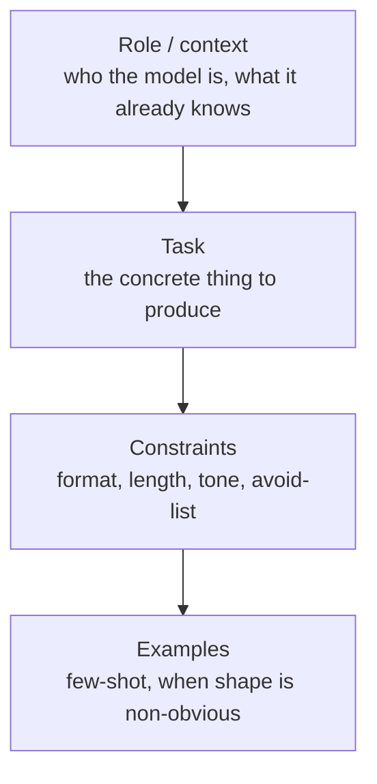

Quick-reference cheat sheet for prompting LLMs, meant to be skimmed rather than read top to bottom.

## Structure

1. **Role / context** — who the model is acting as, and what it already knows.
2. **Task** — the concrete thing to produce, stated as an instruction, not a question.
3. **Constraints** — format, length, tone, things to avoid.
4. **Examples** — 1-3 few-shot examples when the output shape is non-obvious.

## Things that reliably help

- Put the most important instruction last (recency bias) or repeat it at both ends for long prompts.
- Ask for a specific output format (JSON schema, markdown headers) instead of "be organized."
- Give the model an explicit way to say "I don't know" / "not enough info" — reduces confident hallucination.
- Break multi-step tasks into an explicit numbered plan before execution.

## Things that reliably hurt

- Vague adjectives ("good", "professional") without a concrete example of what that means.
- Over-long system prompts that bury the actual task instruction.
- Negative-only instructions ("don't do X") without saying what to do instead.

## Related

- [[notes/skill-design-pattern|Skill Design Pattern (agent skills)]]
