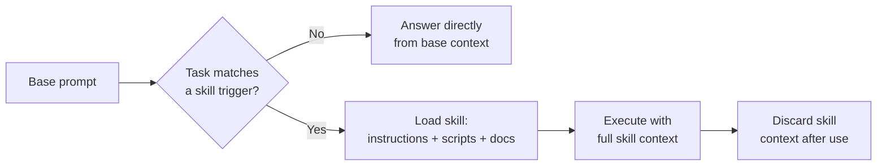

Quick note triggered by a YouTube video on the "skill" design pattern for coding agents.

## Core idea

A **skill** packages a reusable procedure — instructions, scripts, reference docs — that an agent loads on demand instead of carrying in its base prompt at all times. This keeps the default context small while still giving the agent access to deep, specialized workflows when they're actually relevant.

This is why context stays small at rest: the agent only pays for a skill's tokens on the branch where it's actually needed.

## Why it matters

- **Progressive disclosure**: the agent only pays the context cost for a skill when the task actually triggers it.
- **Composability**: skills can be authored independently (by a team, or shared publicly) and dropped into an agent's toolbox without touching its core prompt.
- **Versionability**: a skill is just files (markdown + scripts) — easy to diff, review, and ship like normal code.

## Where I've seen this in practice

- Claude Code's own `.claude/skills/` mechanism — a `SKILL.md` with frontmatter (name + trigger description) plus supporting scripts/docs.
- My own house skills (`brb-git-flow`, `brb-webapp-scaffold`, etc.) follow the same shape: one skill = one bounded, reusable workflow.

## Open questions

- How fine-grained should a skill be before it's better split into two?
- When does a skill's reference material belong inline vs. as a separate doc the skill points to?

## Related

- [[cheatsheets/prompting-basics|Prompting Basics Cheat Sheet]]
